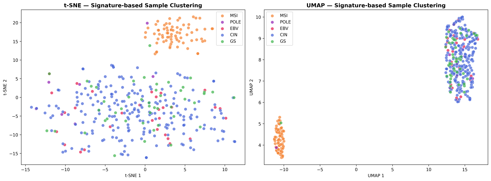
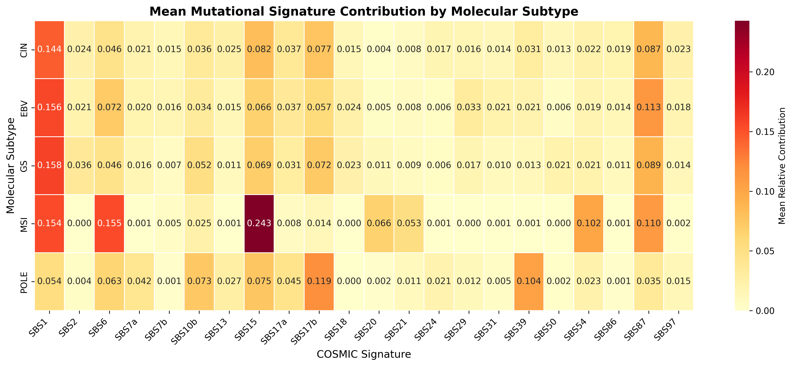
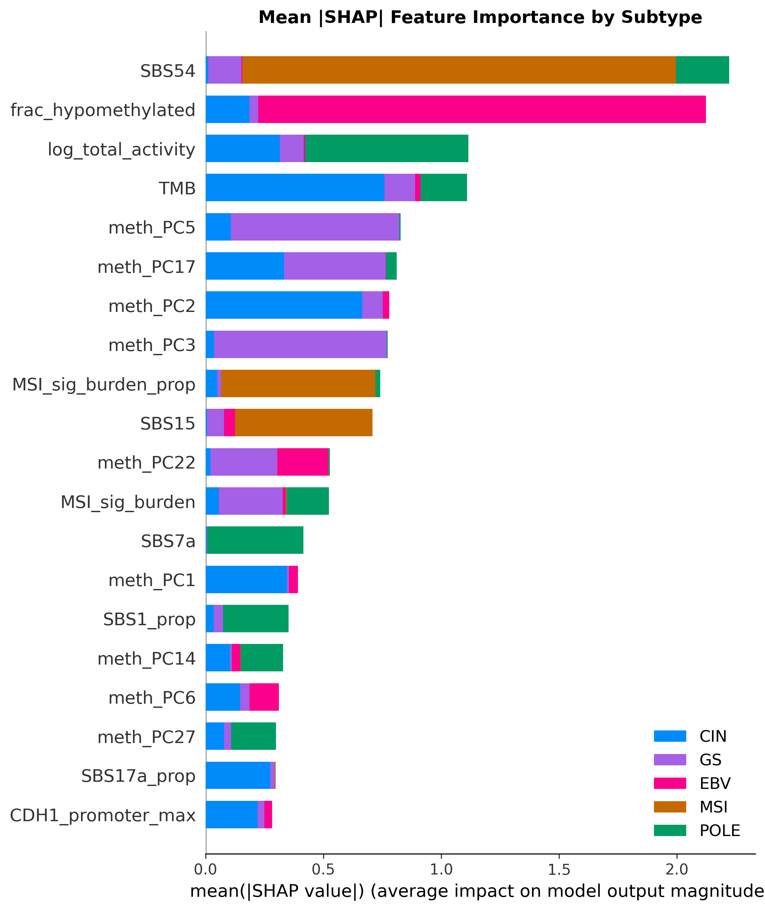
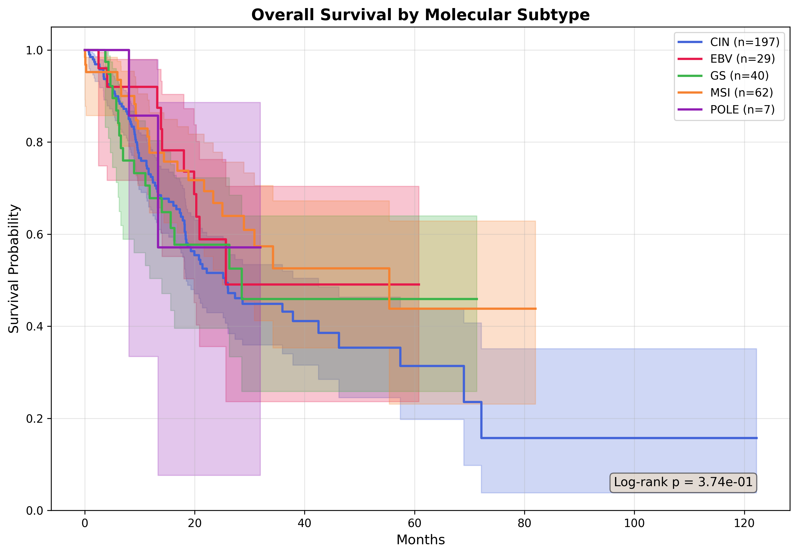

<p align="center">
  <h1 align="center">🧬 AI-Driven Multi-Omics Gastric Cancer Subtyping</h1>
  <p align="center">
    <strong>A Biological Hybrid AI pipeline for molecular subtyping of gastric cancer integrating WES mutational signatures, DNA methylation, and clinical data</strong>
  </p>
  <p align="center">
    <a href="#-key-results">Results</a> •
    <a href="#-pipeline-architecture">Architecture</a> •
    <a href="#-installation">Install</a> •
    <a href="#-quick-start">Quick Start</a> •
    <a href="#-methodology">Methodology</a>
  </p>
  <p align="center">
    
    
    
    
    
    
  </p>
</p>

---

## 📋 Overview

An end-to-end multi-omics pipeline for classifying **TCGA-STAD gastric cancer** into **5 molecular subtypes** — CIN, EBV, GS, MSI, and POLE.

Standard ML classifiers suffer from the **accuracy paradox** — a model can hit ~89% accuracy by favoring the majority CIN class while catastrophically failing on rare but clinically critical subtypes like POLE (1.9% of samples) and GS (12.3%). This pipeline solves that with the **Biological Hybrid AI (BHAI)** framework — deterministic biological rules for POLE and GS that supplement SMOTE-XGBoost where synthetic data alone isn't enough.

| Data Layer | Source | Samples |
|---|---|---|
| **Somatic Mutations** | GDC Masked MAF files (WES) | 431 |
| **DNA Methylation** | Illumina 450K β-values | 457 |
| **Clinical Labels** | GDC + cBioPortal | 375 labelled |

> **Improved version of [Machine-Learning-Mutational-Signatures](https://github.com/Ahsansayz/Machine-Learning-Mutational-Signatures)**  
> Original used MAF only → this adds **DNA methylation**, **20 driver gene features**, and the **Hybrid AI** framework.

---

## 🏆 Key Results

### Stepwise Performance

| Strategy | Accuracy | Macro F1 | MSI Recall | GS Recall | POLE Recall |
|---|---|---|---|---|---|
| SMOTE + XGBoost Baseline | 89.3% | 0.812 | 100% | 41.3% | 28.6% |
| + Hybrid Biological Rules | 90.5% | 0.847 | 100% | 58.7% | **57.1%** |
| **+ Threshold Optimisation** | **91.2%** | **0.860** | **100%** | **63.0%** | **57.1%** |

### Per-Class Breakdown (Final Model)

| Subtype | Precision | Recall | F1-Score | Support |
|---|---|---|---|---|
| CIN | 0.94 | 0.96 | 0.95 | 219 |
| EBV | 0.90 | 0.83 | 0.86 | 30 |
| GS | 0.72 | 0.63 | 0.67 | 46 |
| MSI | 0.99 | 1.00 | 0.99 | 73 |
| POLE | 0.80 | 0.57 | 0.67 | 7 |

### Highlights
- **POLE recall: 28.6% → 57.1%** via single biological rule (SBS10 + TMB)
- **GS recall: 41.3% → 63.0%** via CDH1/RHOA mutation logic + threshold tuning
- **MSI recall: 100%** maintained across all strategies
- **COSMIC reconstruction: 0.933 avg cosine similarity** across 431 samples

### Figures

<p align="center">
  
  
</p>
<p align="center">
  
  
</p>

---

## 🏗️ Pipeline Architecture

```
 ┌───────────────────────────────────────────────────────────────┐
 │                      INPUT DATA SOURCES                       │
 │  MAF Files (431)   │  Methylation (457)  │  Clinical (GDC)    │
 └───────┬────────────┴──────────┬──────────┴──────────┬─────────┘
         │                       │                     │
         ▼                       │                     │
 ┌─ Step 1 ─────────────┐       │                     │
 │ Process MAF Files     │       │                     │
 │ • 96-ch SBS Matrix    │       │                     │
 │ • 20 Driver Genes     │       │                     │
 └───────┬───────────────┘       │                     │
         ▼                       │                     │
 ┌─ Step 2 ─────────────┐       │                     │
 │ NMF Extraction (k=9)  │       │                     │
 └───────┬───────────────┘       │                     │
         ▼                       │                     │
 ┌─ Step 3 ─────────────┐       │                     │
 │ COSMIC v3.4 NNLS      │       │                     │
 │ 83 active signatures  │       │                     │
 └───────┬───────────────┘       │                     │
         │                       │                     │
         ▼                       ▼                     ▼
 ┌─ Step 4 ─────────────────────────────────────────────────────┐
 │ Multi-Omics Feature Matrix → 281 features                    │
 └───────┬──────────────────────────────────────────────────────┘
         │
         ▼
 ┌─ Step 5 ─────────────┐
 │ Methylation Processing│
 │ Two-pass, RAM-optimized│
 └───────┬───────────────┘
         ▼
 ┌─ Step 6 ─────────────────────────────────────────────────────┐
 │ Biological Hybrid AI Classification                          │
 │  POLE Rule (SBS10+TMB) │ GS Rule (CDH1/RHOA) │ SMOTE-XGB   │
 └───────┬──────────────────────────────────────────────────────┘
         ▼
 ┌─ Step 7 ─────────────┐
 │ Visualization (SHAP,  │
 │ t-SNE, UMAP, Survival)│
 └───────────────────────┘
```

---

## 📁 Repository Structure

```
├── 02_methylation_data/          # Processed methylation features
│   ├── methylation_features.csv
│   ├── methylation_pca.csv          (30 PCA components)
│   ├── methylation_targeted.csv     (MLH1, CDH1, CDKN2A, MGMT, BRCA1, RUNX3)
│   └── methylation_summary.csv      (CIMP score, global stats)
│
├── 03_pipeline_scripts/          # Core pipeline
│   ├── step1_process_maf.py         → SBS96 + gene features
│   ├── step2_extract_signatures.py  → NMF (k=9)
│   ├── step3_cosmic_assignment.py   → COSMIC v3.4 NNLS
│   ├── step4_build_features.py      → 281-feature matrix
│   ├── step5_process_methylation.py → Two-pass methylation
│   ├── step6_classify.py            → Hybrid AI classifier
│   ├── step7_visualize.py           → Publication figures
│   └── run_pipeline.sh              → Master runner
│
├── 07_figures/                   # Publication-ready figures
├── 08_clinical_data/             # Clinical + subtype labels
├── 09_documentation/             # Detailed docs
├── requirements.txt
├── LICENSE
└── README.md
```

---

## ⚙️ Installation

```bash
git clone https://github.com/Ahsansayz/AI-Driven-Multi-Omics-Gastric-Cancer-Subtyping.git
cd AI-Driven-Multi-Omics-Gastric-Cancer-Subtyping

python -m venv venv
source venv/bin/activate

pip install -r requirements.txt
```

### Data Setup

1. **MAF Files** — Download TCGA-STAD masked somatic MAFs from [GDC](https://portal.gdc.cancer.gov/) → `01_raw_data/maf_files/`
2. **COSMIC Reference** — Download COSMIC v3.4 SBS signatures → `01_raw_data/cosmic_reference/`
3. **Methylation** *(optional)* — Pre-processed features already included in `02_methylation_data/`

---

## 🚀 Quick Start

```bash
# Full pipeline
bash 03_pipeline_scripts/run_pipeline.sh

# Individual steps
python 03_pipeline_scripts/step1_process_maf.py      # MAF → SBS96 + genes
python 03_pipeline_scripts/step2_extract_signatures.py # NMF extraction
python 03_pipeline_scripts/step3_cosmic_assignment.py  # COSMIC mapping
python 03_pipeline_scripts/step4_build_features.py     # Feature matrix
python 03_pipeline_scripts/step5_process_methylation.py # Methylation
python 03_pipeline_scripts/step6_classify.py           # Classification
python 03_pipeline_scripts/step7_visualize.py          # Figures

# Run specific steps only
bash 03_pipeline_scripts/run_pipeline.sh 6 7
```

---

## 🧠 Methodology

### Biological Hybrid AI

Three strategies combined:

**1. POLE Override** — SBS10 total > threshold + TMB > 7.0 mut/Mb + MSI safeguard (SBS15 check)  
**2. GS Rescue** — Evidence scoring: CDH1 truncating (3pt) + RHOA (2pt) + CDH1 missense (1pt) + TP53 wt (1pt). Override at score ≥ 3 when ML confidence < 0.50  
**3. SMOTE-XGBoost** — 500 trees, stratified 5-fold CV, per-class threshold optimization

### 281 Feature Matrix

| Block | Count | Source |
|---|---|---|
| COSMIC activities (abs + proportional) | 166 | NNLS fitting |
| Engineered + Clinical | 15 | TMB, MSI burden, age, etc. |
| Methylation (targeted + PCA + summary) | 47 | Two-pass processing |
| Gene mutations (20 genes × binary + count + CDH1 detail + variant stats) | 53 | MAF parsing |
| **Total** | **281** | |

### Comparison with Original Pipeline

| | [Original](https://github.com/Ahsansayz/Machine-Learning-Mutational-Signatures) | **This Version** |
|---|---|---|
| Data | MAF only | MAF + Methylation + Clinical |
| Features | ~179 | **281** |
| Gene Mutations | ❌ | ✅ 20 driver genes |
| Methylation | ❌ | ✅ CpGs + CIMP + PCA |
| Classification | XGBoost | **Hybrid Biological AI** |
| POLE Recall | ~28% | **57.1%** |
| GS Recall | ~41% | **63.0%** |
| Accuracy | ~85% | **91.2%** |

---

## 📄 License

MIT License — see [LICENSE](LICENSE)

---

<p align="center">
  <sub>Built for precision oncology research</sub>
</p>
